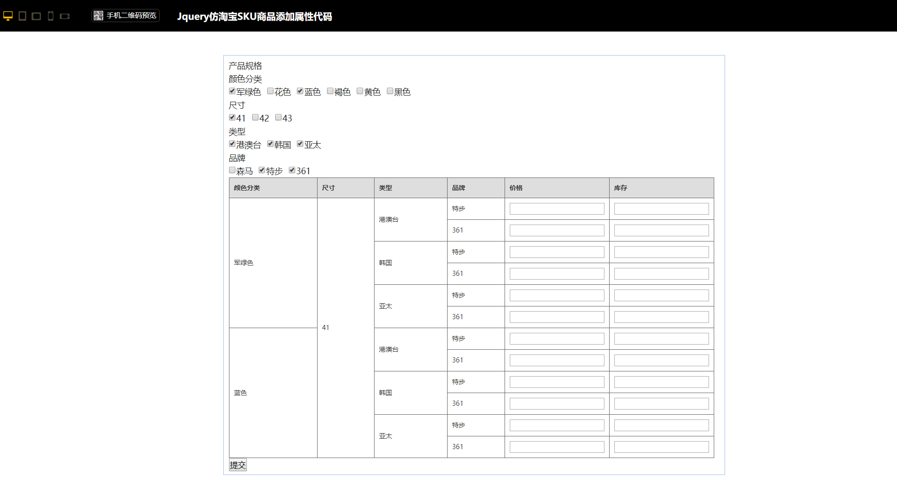

# SKU商品后台管理规格生成

## 关于：

在做商品管理系统经常遇到一个需求，需要在前台动态添加商品SKU，然后生成表格，给每个不同的商品录入价格与库存等等参数。

大概效果像这样，[http://www.17sucai.com/pins/demo-show?id=8131](http://www.17sucai.com/pins/demo-show?id=8131)



直接上实现代码，公司一位大牛实现的。自己对于数组迭代嵌套循环逻辑感很差。


```javascript
// 这是商品规格数据
const sskuObj = {
    color: ['green', 'red', 'yellow'],
    size: ['X1', 'X2', 'X3'],
}
// 这是我们要得到的数据，然后洗一下数据就OK，给每一行添加价格库存等数据，可以配合element-ui表格使用
[ { color: 'green', size: 'X1' },
  { color: 'green', size: 'X2' },
  { color: 'green', size: 'X3' },
  { color: 'red', size: 'X1' },
  { color: 'red', size: 'X2' },
  { color: 'red', size: 'X3' },
  { color: 'yellow', size: 'X1' },
  { color: 'yellow', size: 'X2' },
  { color: 'yellow', size: 'X3' } ]

// 核心方法 

/**
 * @param {Object} skuObj 输入的商品规格对象
 * @returns {Array} 返回规格对象穷举的结果
 */
function j2a(skuObj) {
    const data = Object.values(skuObj)
    const newA = doExchange(data)
    const newB = []
    for (let ai = 0; ai < newA.length; ai++) {
        const newAAA = newA[ai].split('|')
        let aCount = 0
        for (const attr in skuObj) {
            newB[ai] = newB[ai] ? newB[ai] : {}
            newB[ai][attr] = newAAA[aCount]
            aCount++
        }
    }
    return newB
}

function doExchange(arr) {
    var len = arr.length
    // 当数组大于等于2个的时候
    if (len >= 2) {
        // 第一个数组的长度
        var len1 = arr[0].length
        // 第二个数组的长度
        var len2 = arr[1].length
        // 2个数组产生的组合数
        var lenBoth = len1 * len2
        // 申明一个新数组,做数据暂存
        var items = new Array(lenBoth)
        // 申明新数组的索引
        var index = 0
        // 2层嵌套循环,将组合放到新数组中
        for (var i = 0; i < len1; i++) {
            for (var j = 0; j < len2; j++) {
                items[index] = arr[0][i] + '|' + arr[1][j]
                index++
            }
        }
        // 将新组合的数组并到原数组中
        var newArr = new Array(len - 1)
        for (var newi = 2; newi < arr.length; newi++) {
            newArr[newi - 1] = arr[newi]
        }
        newArr[0] = items
        // 执行回调
        return doExchange(newArr)
    } else {
        return arr[0]
    }
}

// 测试和使用
console.log(j2a(sskuObj))
```

